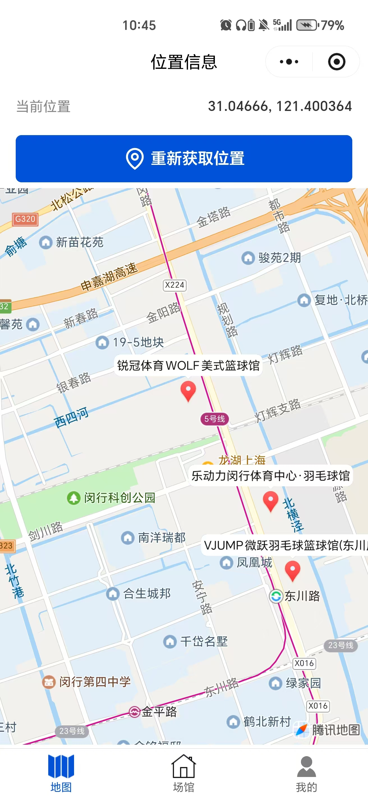
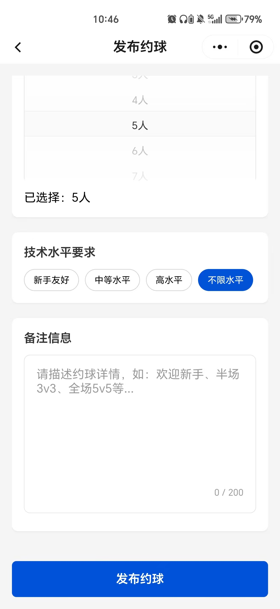
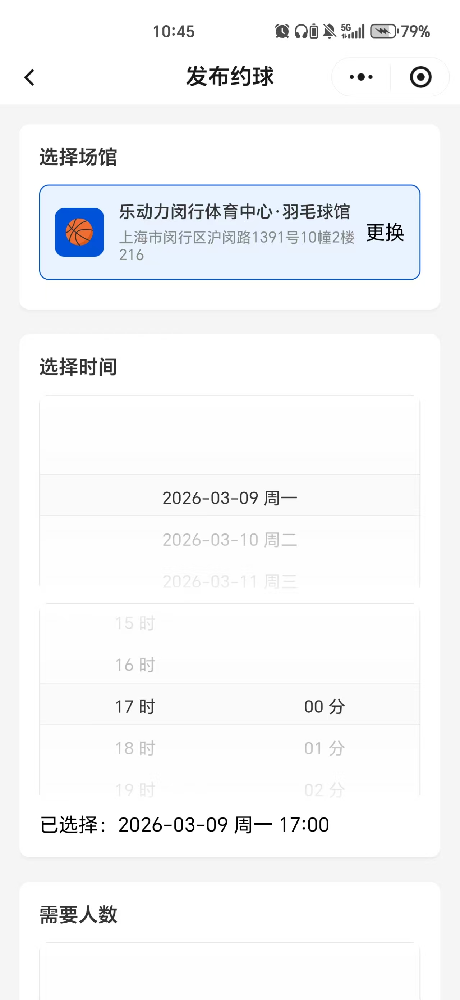
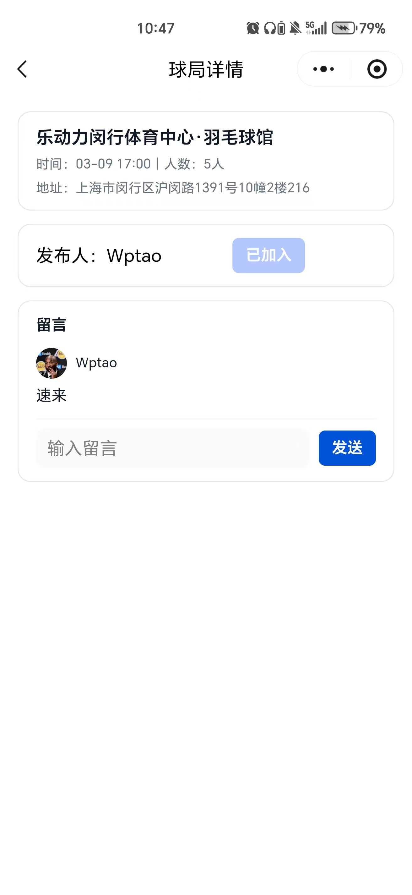
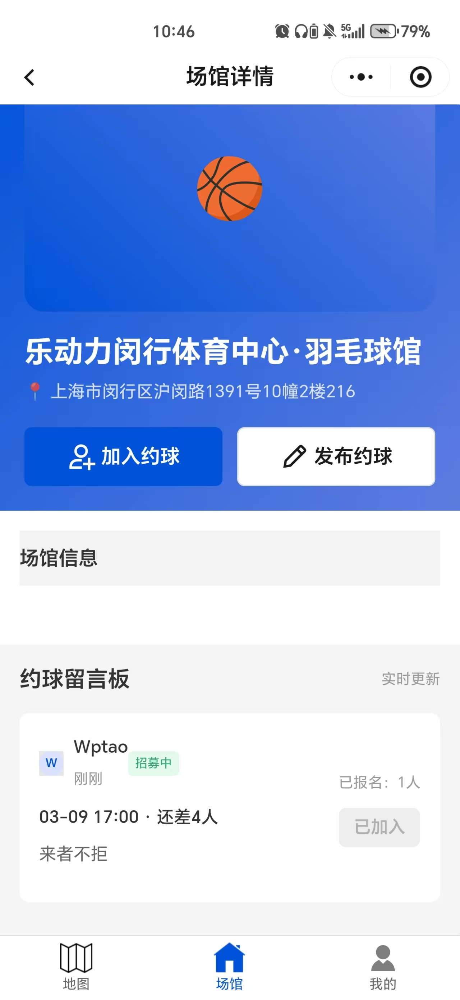

# 篮球约球 - 微信小程序

## 项目介绍

"篮球约球"是一个微信小程序，旨在解决用户找不到人一起打篮球的问题。用户可以通过地图查看附近的篮球场，发布约球信息，加入其他人的约球活动，并接收相关提醒。

## 功能特性

- 🗺️ **地图模式**: 显示用户位置和附近篮球场
- 🏀 **场馆详情**: 查看篮球场信息，浏览约球留言板
- ✨ **发布约球**: 选择场馆、时间、人数等发布约球信息
- 👥 **加入约球**: 实时查看和加入约球活动
- 🔔 **消息提醒**: 订阅约球提醒消息
- 👤 **用户系统**: 微信登录，个人资料管理

## 示意图

将截图放入 `docs/screenshots/` 目录并使用以下文件名，即可在下方自动展示：

- `map.png`（地图页）
- `create.png`（发布约球）
- `venue.png`（场馆详情）
- `detail.png`（球局详情/留言）
- `extra.png`（额外示意图，可替换为任意你想展示的页面）

统一尺寸说明：所有示意图按固定宽度展示（宽度 360px，高度自适应）。你可以替换同名文件，README 将自动引用。

<div align="center">
  
  
  
  
  
</div>

## 技术栈

- **框架**: 微信小程序原生框架
- **语言**: TypeScript
- **UI组件**: TDesign Mini Program
- **云服务**: 微信云开发（云数据库、云函数）
- **地图**: 腾讯地图SDK

## 云开发资源说明

以下为项目使用到的云开发资源（请在你的环境中按需创建，并根据需要设置权限/索引）：

- 云数据库（集合）
  - `users`: 存储用户档案（昵称、头像URL或`avatarFileID`、手机号`phone`、统计`stats`、时间戳等）。
  - `messages`: 存储约球信息（场馆`placeId`/`venueName`、时间`gameTime`、参与者`participants`、评论`comments`、过期时间`expireAt`、公开性`isPublic`等）。
  - `images`: 图片元数据归档（`fileID`、`scene`、`meta`、创建时间等），例如用户头像的存储记录。

- 云存储（对象）
  - 用户头像文件：通过 `avatarFileID` 与 `users` 文档关联；展示时会临时换取可访问 URL。
  - 其他业务图片：暂无强制要求，可按需扩展（推荐在 `images` 集合记录元信息）。

- 云函数（名称 — 作用）
  - `authLogin` — 依据 `openid` 建档/返回用户文档，并在必要时补齐字段。
  - `createMessage` — 创建一条场馆约球信息（写入 `messages`）。
  - `listVenueMessages` — 按 `placeId` 拉取有效（未过期）的约球列表。
  - `getMessageDetail` — 按 `_id` 获取单条约球详情。
  - `joinMessage` — 原子性加入约球（人数与重复加入校验）。
  - `listMyMessages` — 拉取“我的发布/我的参与”的约球列表。
  - `addMessageComment` — 向消息追加评论（带用户昵称与头像处理）。
  - `getUserStats` — 统计当前用户的发布/参与次数。
  - `getPhoneNumber` — 解析手机号并写入到 `users`。
  - `updateUser` — 更新用户资料与统计，并将头像 `fileID` 记录到 `images` 作为元数据归档。
  - `dedupeUsers` — 清理 `users` 集合中的重复或缺失 `_openid` 的文档。

- 云环境与密钥说明
  - 小程序前端本地配置请参考 `miniprogram/utils/config.example.ts`，将真实密钥保存在未提交的本地文件中（`config.ts`）。
  - 云函数内部示例使用了 `cloud.init({ env: '...' })`，请替换为你自己的云环境 ID；如需更安全的配置方式，建议在部署阶段注入环境变量或使用环境别名。

## 项目结构

```
miniprogram/
├── pages/
│   ├── index/          # 首页（地图模式）
│   ├── venue/          # 场馆详情页
│   ├── create/         # 发布约球页
│   ├── mine/           # 个人中心页
│   └── logs/           # 日志页
├── app.js              # 应用入口
├── app.json            # 应用配置
├── app.wxss            # 应用样式
└── project.config.json # 项目配置

prototype/               # HTML原型文件
├── index.html          # 首页原型
├── venue.html          # 场馆页原型
├── create.html         # 发布页原型
└── mine.html           # 我的页面原型

docs/                   # 项目文档
└── prd.md             # 产品需求文档
```

## 安装和运行

### 1. 安装依赖

```bash
npm install
```

### 2. 构建npm

在微信开发者工具中：
1. 点击"工具" -> "构建npm"
2. 等待构建完成

### 3. 运行项目

1. 使用微信开发者工具打开项目
2. 确保已登录微信开发者账号
3. 点击"编译"按钮

## 页面说明

### 首页 (pages/index)
- 地图显示用户位置和附近篮球场
- 快速发布约球和搜索场馆
- 显示附近约球列表

### 场馆详情 (pages/venue)
- 篮球场基本信息
- 约球留言板
- 实时更新约球信息

### 发布约球 (pages/create)
- 选择场馆和时间
- 设置人数和技术要求
- 添加备注信息

### 个人中心 (pages/mine)
- 用户登录和资料管理
- 个人统计数据
- 功能菜单

## 开发说明

### 组件使用
项目使用TDesign Mini Program组件库，所有页面都已配置相应的组件引用。

### 样式规范
- 使用rpx单位适配不同屏幕
- 遵循TDesign设计规范
- 响应式布局设计

### 数据管理
- 使用微信云数据库存储约球信息
- 本地存储管理用户会话
- 实时数据更新机制

## 注意事项

1. 首次运行需要构建npm包
2. 确保微信开发者工具版本支持
3. 云开发功能需要开通相应服务
4. 地图功能需要配置腾讯地图SDK

## 更新日志

- v1.0.0: 完成基础功能开发
- 集成TDesign组件库
- 实现完整的页面流程
- 添加用户登录功能

## 联系方式

如有问题或建议，请联系开发团队。
